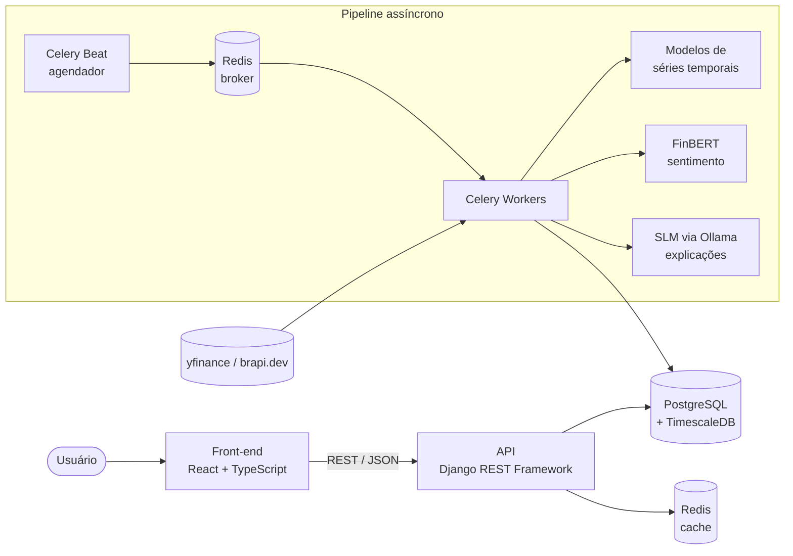

<div align="center">

# 📈 Previsor de Ações

**Plataforma web de previsão de preços de ações do mercado brasileiro (B3) e norte-americano, usando modelos de séries temporais e IA generativa open source.**


</div>

---

> ⚠️ **Aviso:** este é um projeto de portfólio com fins educacionais. As previsões geradas **não constituem recomendação de investimento**. Decisões financeiras devem ser tomadas com apoio de um profissional certificado.

## Sumário

- [Sobre o projeto](#sobre-o-projeto)
- [Funcionalidades](#funcionalidades)
- [Arquitetura](#arquitetura)
- [Stack tecnológica](#stack-tecnológica)
- [Como executar](#como-executar)
- [Estrutura do repositório](#estrutura-do-repositório)
- [Roadmap](#roadmap)
- [Documentação](#documentação)
- [Contribuindo](#contribuindo)
- [Licença](#licença)
- [Autor](#autor)

## Sobre o projeto

O **Previsor de Ações** coleta cotações históricas de ações da B3 e das bolsas norte-americanas, gera previsões de preço com intervalo de confiança e explica cada previsão em linguagem natural.

A solução combina dois tipos de modelo, cada um usado no que faz melhor:

| Problema | Abordagem |
|---|---|
| Prever valores numéricos futuros | Modelos de fundação para séries temporais (Chronos-Bolt / TimesFM), comparados a baselines clássicos |
| Interpretar notícias e explicar a previsão | Modelo de sentimento (FinBERT) e um SLM open source servido localmente (Qwen / Gemma via Ollama) |

Todo o processamento pesado acontece **em segundo plano**, em workers agendados. A API apenas entrega resultados já calculados, o que mantém o front-end rápido.

## Funcionalidades

- 📊 Listagem e gráficos de candlestick de ações da B3 e dos EUA
- 🔮 Previsões de preço com intervalo de confiança
- 📰 Análise de sentimento de notícias por ativo
- 💬 Explicação da previsão em linguagem natural
- 👤 Área do usuário com autenticação (JWT) e carteira/watchlist pessoal
- ⚙️ Pipeline agendado de coleta, previsão e geração de insights
- 📈 Observabilidade completa: logs estruturados, métricas e rastreamento de erros

> Funcionalidades em desenvolvimento. Acompanhe o progresso no [Roadmap](#roadmap).

## Arquitetura



Detalhes em [`docs/arquitetura.md`](docs/arquitetura.md).

## Stack tecnológica

| Camada | Tecnologias |
|---|---|
| **Front-end** | Next.js, React, TypeScript, TanStack Query, Axios, Tailwind CSS, shadcn/ui, Lightweight Charts |
| **Back-end** | Python 3.12, Django, Django REST Framework, SimpleJWT, Celery |
| **IA / ML** | Chronos-Bolt, TimesFM, Prophet/LightGBM (baselines), FinBERT, Ollama (Qwen / Gemma) |
| **Dados** | PostgreSQL 16 + TimescaleDB, Redis |
| **Observabilidade** | structlog, Prometheus, Grafana, Loki, Sentry, Flower |
| **Infra / DevEx** | Docker, Docker Compose, Dev Containers, GitHub Actions |

As decisões técnicas estão registradas em [`docs/adr/`](docs/adr/).

## Como executar

### Pré-requisitos

- [Docker Desktop](https://www.docker.com/products/docker-desktop/) (no Windows, com WSL2)
- [VS Code](https://code.visualstudio.com/) com a extensão **Dev Containers**
- Git

### Passo a passo

```bash
# 1. Clone o repositório (no Windows, dentro do Ubuntu/WSL)
git clone https://github.com/<seu-usuario>/previsor-acoes.git
cd previsor-acoes

# 2. Crie o arquivo de variáveis de ambiente
cp .env.example .env

# 3. Abra no VS Code
code .
```

No VS Code, pressione `Ctrl+Shift+P` e selecione **Dev Containers: Reopen in Container**. Na primeira execução, as imagens são baixadas e o ambiente é configurado automaticamente.

Guia completo e solução de problemas em [`docs/ambiente-de-desenvolvimento.md`](docs/ambiente-de-desenvolvimento.md).

### Serviços disponíveis

| Serviço | Endereço | Status |
|---|---|---|
| Front-end (Next.js) | http://localhost:3000 | 🚧 em breve |
| API (Django) | http://localhost:8000 | 🚧 em breve |
| PostgreSQL | `db:5432` (dentro do container) | ✅ |
| Redis | `redis:6379` (dentro do container) | ✅ |

## Estrutura do repositório

```
previsor-acoes/
├── .devcontainer/          # Ambiente de desenvolvimento (Dev Container + Compose)
├── backend/                # API Django, workers Celery e pipeline de ML
├── frontend/               # Aplicação React + TypeScript
├── docs/
│   ├── adr/                # Registros de decisões de arquitetura
│   ├── arquitetura.md
│   └── ambiente-de-desenvolvimento.md
├── .editorconfig
├── .env.example
├── CHANGELOG.md
├── CONTRIBUTING.md
├── LICENSE
└── README.md
```

## Roadmap

- [x] Ambiente de desenvolvimento com Dev Container, PostgreSQL/TimescaleDB e Redis
- [x] Documentação inicial e registros de decisão
- [ ] **Front-end:** estrutura base (Next.js, TypeScript, Tailwind, App Router)
- [ ] **Front-end:** listagem de ações e gráficos de candlestick
- [ ] **Back-end:** projeto Django, API REST e autenticação JWT
- [ ] **Back-end:** área do usuário e carteira/watchlist
- [ ] **Dados:** coleta agendada de cotações (B3 e EUA) com Celery
- [ ] **IA:** previsões com modelos de séries temporais e avaliação contra baselines
- [ ] **IA:** sentimento de notícias e explicações via SLM
- [ ] **Observabilidade:** logs estruturados, métricas e dashboards
- [ ] **Qualidade:** testes automatizados e CI com GitHub Actions
- [ ] **Deploy:** publicação de uma versão de demonstração

## Documentação

| Documento | Conteúdo |
|---|---|
| [Arquitetura](docs/arquitetura.md) | Componentes, fluxo de dados e responsabilidades |
| [Ambiente de desenvolvimento](docs/ambiente-de-desenvolvimento.md) | Instalação, uso diário e solução de problemas |
| [Decisões de arquitetura (ADRs)](docs/adr/) | Por que cada tecnologia foi escolhida |
| [Guia de contribuição](CONTRIBUTING.md) | Padrões de branch, commit e código |
| [Changelog](CHANGELOG.md) | Histórico de versões |

## Contribuindo

Sugestões e contribuições são bem-vindas. Leia o [guia de contribuição](CONTRIBUTING.md) antes de abrir uma issue ou pull request.

## Licença

Distribuído sob a licença MIT. Veja [`LICENSE`](LICENSE).

Os gráficos utilizam a biblioteca [Lightweight Charts™](https://github.com/tradingview/lightweight-charts), da TradingView.

## Autor

**Vitor**

[](https://www.linkedin.com/in/<seu-perfil>)
[](https://github.com/<seu-usuario>)
