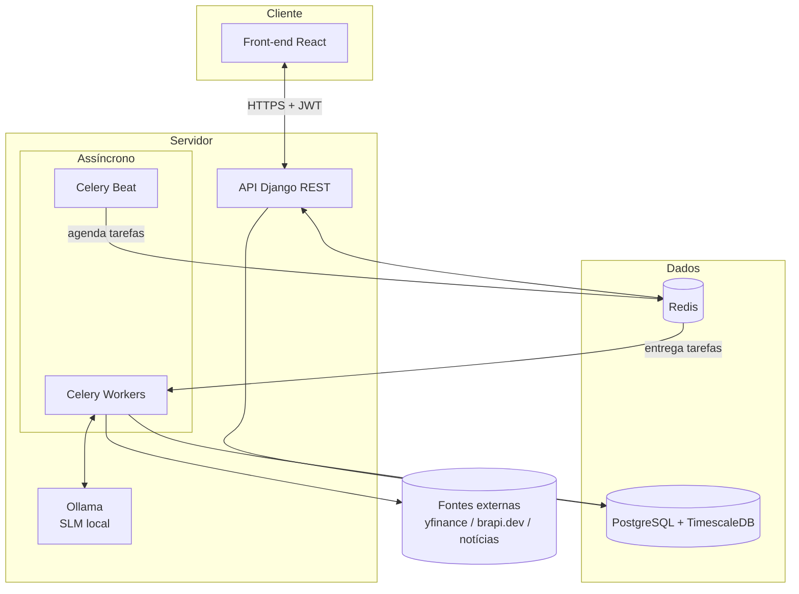
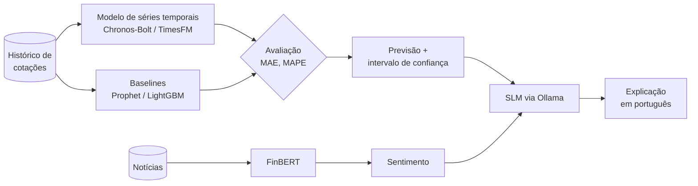
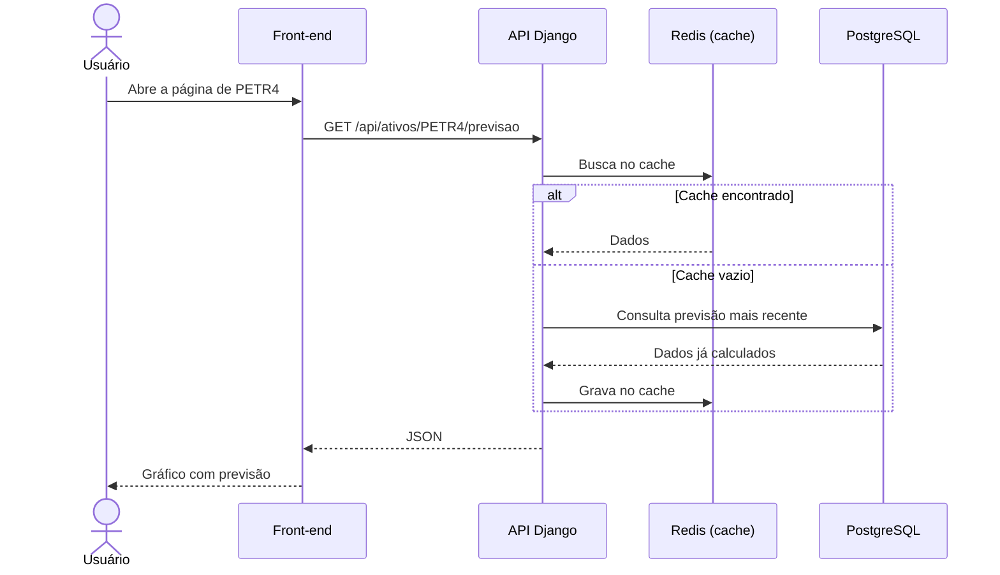

# Arquitetura

Este documento descreve os componentes do **Previsor de Ações**, como eles se comunicam e qual a responsabilidade de cada um.

> Documento vivo: será atualizado à medida que os componentes forem implementados.

## Visão geral

O sistema segue um princípio central: **o processamento pesado nunca acontece durante uma requisição do usuário.**

Coleta de dados, previsões e geração de textos rodam em segundo plano, de forma agendada. Os resultados são gravados no banco, e a API apenas os lê. Isso mantém o tempo de resposta baixo e previsível, mesmo com modelos de IA custosos.

## Componentes

### Front-end

| | |
|---|---|
| **Tecnologias** | Next.js, React, TypeScript, TanStack Query, Axios, Tailwind CSS, shadcn/ui, Lightweight Charts |
| **Responsabilidades** | Listagem e busca de ativos; gráficos de candlestick com sobreposição da previsão; exibição de sentimento e explicações; login, cadastro e área do usuário |
| **Comunicação** | Consome exclusivamente a API REST. O token JWT é anexado automaticamente pelo Axios |

O **TanStack Query** gerencia o estado vindo do servidor (cache, revalidação, retry), enquanto o estado local da interface fica nos próprios componentes.

### API (Django REST Framework)

| | |
|---|---|
| **Tecnologias** | Django, Django REST Framework, SimpleJWT |
| **Responsabilidades** | Autenticação e gestão de usuários; endpoints de ativos, cotações, previsões e insights; carteira/watchlist do usuário; painel administrativo |
| **Regra** | Nenhum endpoint executa modelos de IA ou chama fontes externas de forma síncrona |

### Pipeline assíncrono (Celery)

Tarefas agendadas pelo **Celery Beat** e executadas pelos **workers**, usando Redis como broker:

| Tarefa | Frequência prevista | Descrição |
|---|---|---|
| `coletar_cotacoes` | Após o fechamento de cada mercado | Baixa cotações OHLCV e grava na hypertable |
| `gerar_previsoes` | Após a coleta | Roda os modelos de séries temporais para cada ativo |
| `analisar_noticias` | Algumas vezes ao dia | Coleta manchetes e calcula o sentimento |
| `gerar_explicacoes` | Após previsões e sentimento | Usa o SLM para redigir um resumo em português |

As tarefas são **idempotentes**: reexecutar a mesma tarefa para o mesmo ativo e data não duplica dados.

### Camada de IA

- **Previsão numérica:** modelos de fundação para séries temporais, avaliados contra baselines clássicos. As métricas ficam registradas para comparação.
- **Sentimento:** FinBERT para textos em inglês e um modelo baseado em BERTimbau para português.
- **Linguagem natural:** um SLM recebe a previsão e o sentimento como contexto e gera a explicação. Ele **não** produz números de previsão.

Veja a justificativa em [ADR 0004](adr/0004-modelos-de-ia.md).

### Banco de dados

| Armazenamento | Uso |
|---|---|
| **PostgreSQL** | Usuários, ativos, carteiras, previsões, insights |
| **TimescaleDB** (extensão) | Cotações históricas em hypertables, com compressão e agregações temporais |
| **Redis** | Cache de respostas da API e broker do Celery |

## Fluxo de uma requisição

## Observabilidade

| Sinal | Ferramenta |
|---|---|
| Logs estruturados (JSON) | structlog → Grafana Loki |
| Métricas da API e dos workers | django-prometheus → Prometheus → Grafana |
| Erros e exceções | Sentry |
| Filas e tarefas do Celery | Flower |
| Rastreamento distribuído (opcional) | OpenTelemetry |

## Segurança

- Autenticação via JWT com tokens de acesso de curta duração e refresh token.
- Senhas armazenadas com o hasher padrão do Django (PBKDF2/Argon2).
- Segredos e credenciais apenas em variáveis de ambiente (`.env`), nunca versionados.
- CORS restrito à origem do front-end.
